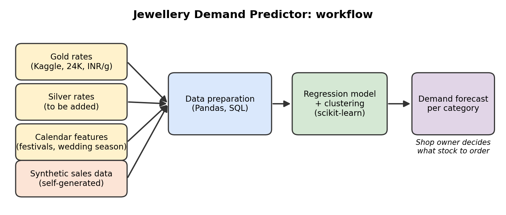

# Jewellery Demand Predictor

Final project for the Building AI course

## Summary

Predicts weekly demand for gold and silver jewellery from metal prices, seasonality and festivals, helping small shop owners plan stock and avoid tying up cash. Building AI course project.

## Background

Small jewellery shops hold a lot of value in inventory, and demand shifts with gold and silver prices, wedding seasons and festivals. Most owners plan stock from experience and gut feeling.

Problems this idea addresses:
* overstocking slow-moving items ties up cash
* understocking during peak seasons (festivals, wedding season) loses sales
* metal price swings change what customers buy, and it is hard to track by hand

My motivation is personal: my family runs a gold and silver jewellery shop, and I have helped there. I have seen how stocking decisions are made without data, and I wanted to see whether a simple model could support them.

## How is it used?

The main user is a small shop owner or manager, who would use it before placing weekly or monthly orders.

1. The user enters (or the system fetches) the latest gold and silver rates and the upcoming calendar (festivals, wedding season).
2. The model outputs the expected demand per product category (for example gold rings, silver utensils, chains) for the coming weeks.
3. The owner compares the forecast with current stock and decides what to order.

The output is meant as decision support. The owner stays in charge and can override it based on local knowledge.

  

## Data sources and AI methods

**Data**
* **Gold prices:** real historical retail gold prices in India (24K, INR per gram, from 2016 onwards), from a public Kaggle dataset. Silver prices will be added from a separate public source.
* **Sales transactions:** real shop records are not available for this project, so I generate **synthetic** sales data. It is built to depend on metal prices, seasonality and festivals, plus random noise. Because the sales are synthetic, the results show that the pipeline works but do **not** prove the model would be accurate in a real shop.

| Data | Source | Type |
| ---- | ------ | ---- |
| Gold rates (24K, INR/gram) | Public Kaggle dataset | Real |
| Silver rates | To be added from a public source | Real |
| Sales transactions | Self-generated | Synthetic |
| Calendar features (month, festival, wedding season) | Derived | Real dates |

**AI methods**
* **Regression** (linear regression, then tree-based models such as random forest) to predict demand per category.
* **Clustering** (k-means) to group products or sales periods with similar behaviour.
* **Validation:** train/test split by time and cross-validation, to check the model generalizes and does not just overfit.
* **Tools:** Python, Pandas, Scikit-learn, SQL for querying the data.

## Challenges

What this project does not solve:
* The sales data is synthetic, so real accuracy is unknown until it is tested with real shop records.
* The gold dataset is for 24K gold, while much jewellery is 22K or 18K, so prices would need to be adjusted for purity.
* It ignores local factors such as competitors, customer relationships, offers and sudden events.
* Demand for jewellery depends on many things outside the data (economy, weather, personal occasions).
* Forecasts can be wrong, and an owner who trusts them blindly could over- or under-order.

Ethical and practical considerations: shop sales data is commercially sensitive and must be stored securely, and the tool should be presented as a suggestion, not a guarantee.

## What next?

* Test it with real, anonymized sales records from a willing shop and retrain on them.
* Add silver prices and other gold purities (22K, 18K).
* Add product-level forecasts and stock alerts.
* Include more features such as local events, regional price differences and past discounts.
* Build a simple web or mobile dashboard for shop owners.
* Look for collaborators: a shop owner willing to share data, and someone experienced in deploying ML apps.

## Acknowledgments

* Gold price data: "Gold Price in INDIA - 24K/Gram" (India retail market, INR per gram, 2016 onwards) by RRQ R1DDL3 on Kaggle, licensed [CC0: Public Domain](https://creativecommons.org/publicdomain/zero/1.0/)
* Inspiration from the Building AI course by Reaktor Innovations and the University of Helsinki, and the projects in its AI Idea Gallery (for example the food-distribution and energy forecasting ideas)
* Libraries: pandas, NumPy, scikit-learn (open source)
